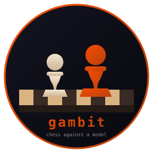
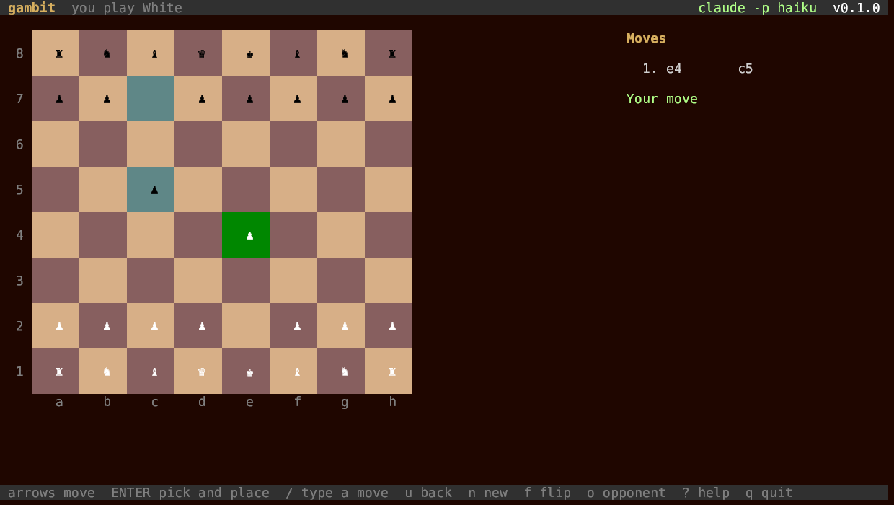

# gambit



**Chess against a language model, in the terminal. Written in Rust.**

   

You play with the cursor keys, or type your moves the way you would write
them: `e4`, `Nf3`, `O-O`. The other side is a model. By default that is the
`claude` command you already have; with a key it can be Anthropic's API,
OpenAI's, anything that speaks the same shape (OpenRouter, a server on your
own machine), or a command of your own.

The board fills the window, and every piece carries its letter under it:
capitals for White, small letters for Black.

The pieces each side has taken stand beside the board, with the point lead
next to whoever is ahead. The header names the model
that actually answered, and the panel keeps the running cost when the
opponent reports one.

gambit knows the rules. Castling, en passant, promotion, stalemate, the
fifty move rule, a threefold repetition, too few pieces to mate: all of it
is counted, and proven by the move counts chess programmers test with.

Part of the [Fe₂O₃ suite](https://isene.github.io/fe2o3/). Built on
[crust](https://github.com/isene/crust).



## Playing

| Key | Action |
|---|---|
| `←` `↑` `↓` `→` / `h` `j` `k` `l` | move the cursor |
| `ENTER` | pick a piece up, and put it down |
| `ESC` | let the piece go |
| `/` | type a move instead: `e4`, `Nf3`, `exd5`, `O-O`, `e2e4` |
| `u` | take back your move and the answer to it |
| `n` | a new game |
| `c` | play the other colour, from a new game |
| `f` | turn the board around |
| `o` | pick the opponent and the model, from a menu |
| `L` | play on lichess, or leave it |
| `R` | resign a lichess game |
| `s` | write the game to `~/.gambit/game.pgn` |
| `?` | every key |
| `q` | quit |

The square you may move to lights up when a piece is picked up. The last
move keeps its colour, and a king in check turns red.

## The opponent

Every turn, the model is told the position, the moves so far and every
legal move, and asked for one of them. An answer that is not a legal move
is asked again, twice. After that gambit plays a plain move itself, and
says so in the panel.

`o` picks who answers, and writes the choice to `~/.gambit/config.yml`:

```yaml
opponent: claude          # claude | anthropic | openai | command
model: ""                 # a model name; empty leaves the choice to the tool
api_key: ""               # or ANTHROPIC_API_KEY / OPENAI_API_KEY in the environment
base_url: "https://api.openai.com/v1"   # any OpenAI-shaped service
command: ""               # for opponent: command
side: white               # the side you play
lichess_token: ""         # or LICHESS_TOKEN in the environment
```

- **claude** needs no key: it runs `claude -p` and reads the answer. A move
  takes ten seconds or so, and costs a few cents, because the command
  carries its own tools and instructions into every call. `model: haiku`
  makes it quicker and cheaper. The API below is cheaper still.
- **anthropic** posts to `api.anthropic.com` with your key.
- **openai** posts to `base_url`, so it also reaches OpenRouter, Groq, or a
  model running on your own machine.
- **command** runs whatever you name. It gets the question on standard
  input and prints one move. Two lines of Python are enough to play a
  random legal move, which is how gambit is tested.

## Lichess

`L` plays on [lichess](https://lichess.org) instead: their computer at any
of its eight levels, or a real opponent over ten minutes. gambit becomes
your board. It follows the game as it is played, shows both clocks, and
sends your moves.

It needs a token with the "Play games with the board API" right, from
<https://lichess.org/account/oauth/token/create?scopes[]=board:play>. `L`
asks for it once and keeps it in the config.

The moves there are yours. Lichess forbids engine help on an ordinary
account, so the model plays no part in a lichess game, and gambit does not
offer to. A model that plays belongs on a BOT account, which is a separate
thing and cannot be undone.

## How strong is it

Weak. Models play the opening from memory and then drift, and the better
ones still hang pieces. The point is a game against something that talks
back. If you want to be beaten properly, play Stockfish.

## Install

```bash
git clone https://github.com/isene/gambit
cd gambit
cargo build --release
```

`crust` is expected as a sibling checkout (`../crust`). Release binaries
for Linux and macOS are on the
[releases page](https://github.com/isene/gambit/releases).

## What it costs to run

Nothing while you think: gambit waits for a key and wakes once a second to
move the clock on. The model's call runs on its own thread, so the board
still answers while it thinks. The rules cost microseconds; the whole
position is copied for each move tried, which is cheaper than undoing them.

## License

Public domain (Unlicense).
